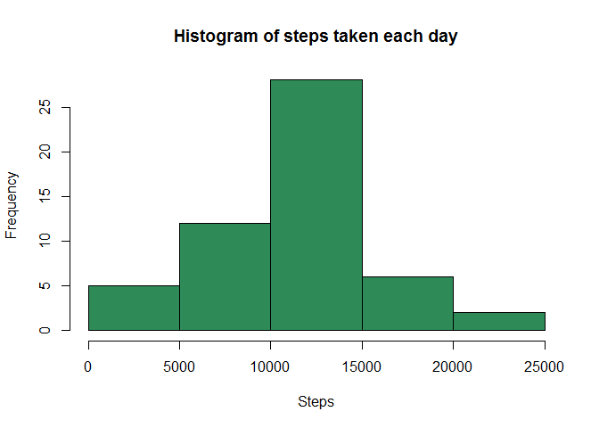
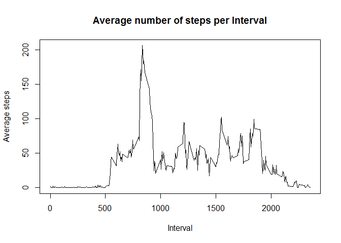
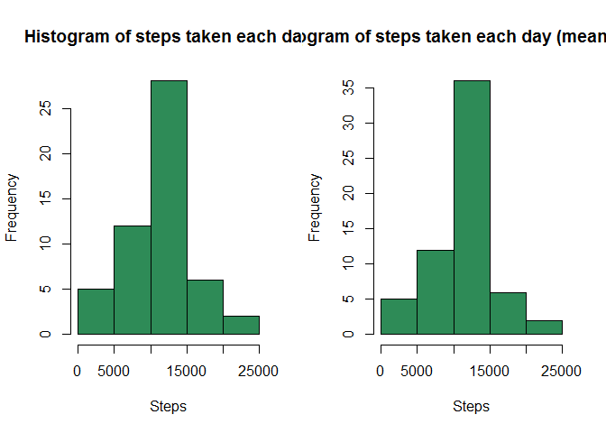
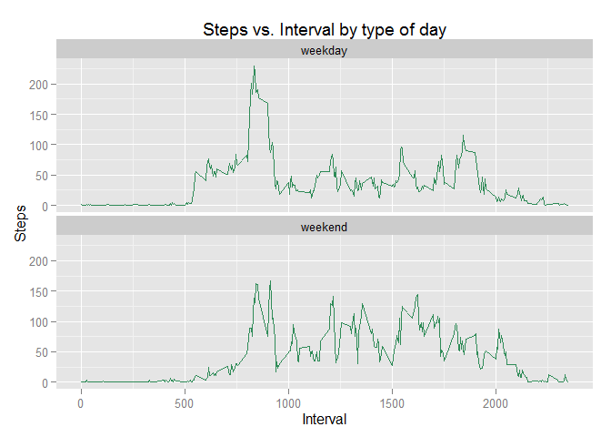

# Reproducible Research: Peer Assessment 1


## Loading and preprocessing the data

```r
## Preliminaries
rm(list=ls())
dir <- "L:/Dateien/Data_Science/05_Reproducible_Research/Ass/Ass1"
setwd(dir)
library(dplyr)
## Load the data
# Location where zip file should be stored
dataLocation <- "L:/Dateien/Data_Science/05_Reproducible_Research/Ass/Ass1/data.zip"
# Download zip file from url
download.file(url="http://d396qusza40orc.cloudfront.net/repdata%2Fdata%2Factivity.zip", destfile=dataLocation)
# Unzip the zip file
unzip("data.zip")
# Load the unziped data file in the workspace
dataFile <- "L:/Dateien/Data_Science/05_Reproducible_Research/Ass/Ass1/activity.csv"
rawData <- read.csv(dataFile)
```


## What is mean total number of steps taken per day?
1. Calculate the total number of steps taken per day

```r
# Total numer of steps taken per day
byDay <- summarise(group_by(rawData, date), total=sum(steps))
```
2. If you do not understand the difference between a histogram and a barplot, research the difference between them. Make a histogram of the total number of steps taken each day

```r
# Histogram of steps taken per day
hist(byDay$total, col="seagreen4", main="Histogram of steps taken each day", xlab="Steps")
```

 

3. Calculate and report the mean and median of the total number of steps taken per day

```r
mean(byDay$total, na.rm=TRUE)
```

```
## [1] 10766.19
```

```r
median(byDay$total, na.rm=TRUE)
```

```
## [1] 10765
```

## What is the average daily activity pattern?
1. Make a time series plot (i.e. type = "l") of the 5-minute interval (x-axis) and the average number of steps taken, averaged across all days (y-axis)

```r
# Aggregate the intervals and then plot them with the average steps taken
aggdata <- summarise(group_by(rawData, interval), average=mean(steps, na.rm=TRUE))
plot(aggdata, type="l", main="Average number of steps per Interval", xlab="Interval", ylab="Average steps")
```

 

2. Which 5-minute interval, on average across all the days in the dataset, contains the maximum number of steps?

```r
aggdata[which.max(aggdata$average),]
```

```
## Source: local data frame [1 x 2]
## 
##   interval  average
## 1      835 206.1698
```

## Imputing missing values
1. Calculate and report the total number of missing values in the dataset (i.e. the total number of rows with NAs)

```r
sum(is.na(rawData))
```

```
## [1] 2304
```
2. Devise a strategy for filling in all of the missing values in the dataset. The strategy does not need to be sophisticated. For example, you could use the mean/median for that day, or the mean for that 5-minute interval, etc.

I chose a strategy that replaces each NA with the mean of its corresponding 5-minute interval. It is implemented using a for loop that replaces the NAs with the previously calculated mean values (from aggdata). Steps 2 and 3 are in some way combined.


```r
# Replace NAs with mean of that 5 minute interval
rawData2 <- rawData
for(i in 1:nrow(rawData2)){
        if(is.na(rawData2$steps[i])){
                rawData2$steps[i] <- aggdata$average[which(aggdata$interval==rawData2$interval[i])]
        }
}
```

3. Create a new dataset that is equal to the original dataset but with the missing data filled in.

The dataset has already been created using the for loop. At this point we can look at the head of both datasets to ensure the loop has properly worked.

```r
head(rawData)
```

```
##   steps       date interval
## 1    NA 2012-10-01        0
## 2    NA 2012-10-01        5
## 3    NA 2012-10-01       10
## 4    NA 2012-10-01       15
## 5    NA 2012-10-01       20
## 6    NA 2012-10-01       25
```

```r
head(rawData2)
```

```
##       steps       date interval
## 1 1.7169811 2012-10-01        0
## 2 0.3396226 2012-10-01        5
## 3 0.1320755 2012-10-01       10
## 4 0.1509434 2012-10-01       15
## 5 0.0754717 2012-10-01       20
## 6 2.0943396 2012-10-01       25
```

4. Make a histogram of the total number of steps taken each day and Calculate and report the mean and median total number of steps taken per day. Do these values differ from the estimates from the first part of the assignment? What is the impact of imputing missing data on the estimates of the total daily number of steps?


```r
byDay2 <- summarise(group_by(rawData2, date), total=sum(steps))
par(mfrow=c(1,2))
hist(byDay$total, main="Histogram of steps taken each day", xlab="Steps", col="seagreen4")
hist(byDay2$total, main="Histogram of steps taken each day (means for NA)", xlab="Steps", col="seagreen4")
```

 

The version where the NAs have been replaced by the average steps taken shows a higher clustering. This makes sense as we now have more observations.

## Are there differences in activity patterns between weekdays and weekends?
1. Create a new factor variable in the dataset with two levels - "weekday" and "weekend" indicating whether a given date is a weekday or weekend day.


```r
rawData2$weekday <- ifelse(((weekdays(as.Date(rawData2$date))=="Samstag") |(weekdays(as.Date(rawData2$date))=="Sonntag")) , "weekend", "weekday")
byDay2$weekday <- ifelse(((weekdays(as.Date(byDay2$date))=="Samstag") |(weekdays(as.Date(byDay2$date))=="Sonntag")) , "weekend", "weekday")
```

5. Make a panel plot containing a time series plot (i.e. type = "l") of the 5-minute interval (x-axis) and the average number of steps taken, averaged across all weekday days or weekend days (y-axis). See the README file in the GitHub repository to see an example of what this plot should look like using simulated data.


```r
aggdata2 <- aggregate(steps~interval+weekday, rawData2, mean)
library(ggplot2)
ggplot(aggdata2, aes(x=aggdata2$interval, y=aggdata2$steps))+
        geom_line(colour="seagreen4", linetype=1)+
        facet_wrap(~ weekday, ncol = 1)+
        labs(title="Steps vs. Interval by type of day", x="Interval", y="Steps")
```

 

